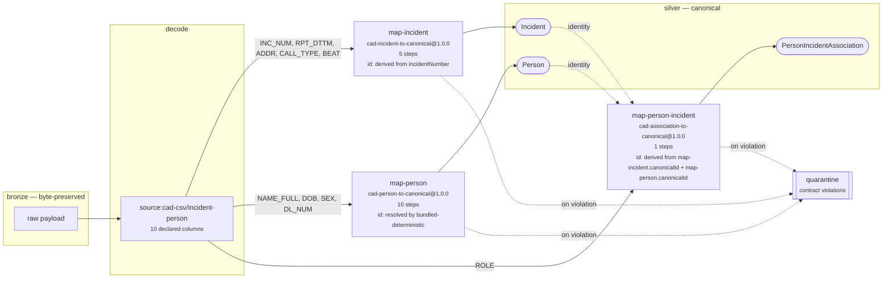

```mermaid
flowchart LR
  %% cad-to-canonical@1.0.0  --  source riverton-pd-cad

  subgraph bronze["bronze&nbsp;&mdash;&nbsp;byte-preserved"]
    payload["raw payload"]
  end

  subgraph decode["decode"]
    source["source:cad-csv/incident-person<br/><small>10 declared columns</small>"]
  end

  payload --> source

  subgraph silver["silver&nbsp;&mdash;&nbsp;canonical"]
    out_map_incident(["Incident"])
    out_map_person(["Person"])
    out_map_person_incident(["PersonIncidentAssociation"])
  end

  hop_map_incident["map-incident<br/><small>cad-incident-to-canonical@1.0.0</small><br/><small>5 steps</small><br/><small>id: derived from incidentNumber</small>"]
  hop_map_person["map-person<br/><small>cad-person-to-canonical@1.0.0</small><br/><small>10 steps</small><br/><small>id: resolved by bundled-deterministic</small>"]
  hop_map_person_incident["map-person-incident<br/><small>cad-association-to-canonical@1.0.0</small><br/><small>1 steps</small><br/><small>id: derived from map-incident.canonicalId + map-person.canonicalId</small>"]

  source -->|INC_NUM, RPT_DTTM, ADDR, CALL_TYPE, BEAT| hop_map_incident
  source -->|NAME_FULL, DOB, SEX, DL_NUM| hop_map_person
  source -->|ROLE| hop_map_person_incident

  hop_map_incident --> out_map_incident
  hop_map_person --> out_map_person
  hop_map_person_incident --> out_map_person_incident
  out_map_person -. identity .-> hop_map_person_incident
  out_map_incident -. identity .-> hop_map_person_incident

  quarantine[["quarantine<br/><small>contract violations</small>"]]
  hop_map_incident -. on violation .-> quarantine
  hop_map_person -. on violation .-> quarantine
  hop_map_person_incident -. on violation .-> quarantine
```
